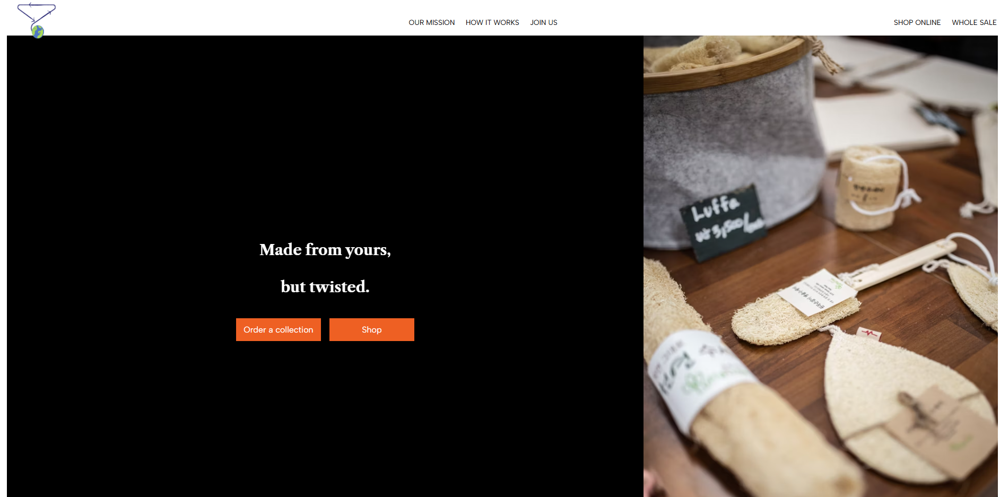

# Twisted Shop Documentation

## Table of contents

- [Twisted Shop Documentation](#twisted-shop-documentation)
  - [Table of contents](#table-of-contents)
  - [Introduction](#introduction)
  - [Project structure](#project-structure)
  - [Steps to run](#steps-to-run)
   
## Introduction

The `twisted` directory contains the source code and resources for the Twisted project. 

Twisted was found to offer a convenient solution to give unwanted clothes another life. It is a service that collects clothes and upcycle them into unique household items such as floor mats, pillows or home decor items. We then either resell them to their owners at a cheaper price or to new owners. Twisted’s customers will get small rewards when giving away their unwanted clothes and be informed of how their clothes are recycled.



## Project structure

- **`package.json`**: Lists the dependencies and scripts for the React application.
- **`public/`**: Contains static files and the main HTML file (`index.html`) for the React app.
  - `index.html`: The main HTML file that serves as the entry point for the React application.
  - `manifest.json`: Configuration file for the web app manifest.
- **`src/`**: Contains the source code for the React application.
  - `index.css`: Global CSS styles for the application.
  - `index.js`: The main JavaScript file that renders the React application.
  - `App.js`: The main application component that sets up routing for different pages.
  - `pages/`: Contains individual page components like `About.js`, `Home.js`, etc.
    - `About.js`: A page component that provides information about the project's social and environmental missions.
  - `components/`: Contains reusable components like `Navbar` and `Footer`.

## Steps to run

To get started with the Twisted project, follow these steps:

1. **Clone the repository:**
     ```sh
     git clone <repository_url>
     ```

2. **Navigate to the project directory:**
     ```sh
     cd twisted
     ```

3. **Install dependencies:**
     ```sh
     npm install
     ```

4. **Run the app:**
     ```sh
     npm run start
     ```
